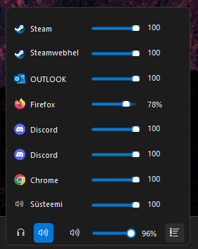

# Taskbar Audio Switcher (v3.3.5)

An extremely lightweight, stable, and convenient Windows 11 utility that automatically places itself on the taskbar (next to the system clock and system tray icons), allowing you to control all computer audio outputs, inputs, and application volumes quickly and comfortably.

### Preview
  


---

## 1. Key Features

1. **Dynamic Audio Device Switching:** Easily cycle between audio outputs (e.g., Speakers, Headphones, HDMI) directly from your taskbar. Active icons display custom 3-letter nicknames or system abbreviations underneath. Supports unlimited output devices.
2. **Microphone Control:** Dedicated microphone button supporting system-wide mute toggle with visual indicators, input device context-menu switching, and active recording monitoring (highlights red when any application is actively using the microphone).
3. **Volume Regulation & Step Customization:** Drag the master slider or scroll your mouse wheel anywhere over the utility bar to adjust the volume. Customize scroll step sizes (1%, 2%, 5%, or 10%).
4. **App Volume Mixer:** Expand a dynamic, lightweight application volume mixer right above the taskbar. Includes mouse-wheel volume routing for individual apps and an option to hide silent background audio sessions.
5. **Quick Monitor Switcher Button:** Shift the utility across screens. Left-click moves the widget to the next monitor to the right; right-click moves it to the next monitor to the left.
6. **High-DPI Per-Monitor Awareness:** Scales dynamically to look razor-sharp on high-resolution monitors (e.g., 100%, 125%, 150%, 200% scaling factors).
7. **System Tray Integration:** A flat, themed context menu (supporting Dark/Light mode) allows adjusting manual device filters, nicknames, startup settings, and alignments.

---

## 2. Installation & Quick Start

### Option 1: Standalone Portable Release (Recommended)
1. Go to the [Releases](https://github.com/karumommik/TaskbarAudioSwitcher/releases) page.
2. Download the latest `TaskbarAudioSwitcher-win-x64.zip` (or `win-arm64` if on an ARM device).
3. Extract the `TaskbarAudioSwitcher.exe` executable to a permanent folder on your computer (e.g., `C:\Program Files\TaskbarAudioSwitcher` or a dedicated folder in your User directory).
4. Double-click the file to run the utility.
5. **Auto-start with Windows:** Right-click the speaker/microphone icon in the system tray and select **"Run at Windows Startup"**.

### Option 2: Microsoft Store Installation
1. Search for **Taskbar Audio Switcher** in the Microsoft Store (or use the Store deep link once published).
2. Install the application natively. Windows Store will handle automatic updates.

---

## 3. Known Behaviors & Quirks

To ensure 24/7 stability and prevent being flagged by antivirus software, this utility runs as a lightweight, borderless Win32 overlay window rather than hooking deep into the Windows Explorer (`explorer.exe`) process memory. As a result, you might notice:
* **Brief Vanishing/Reappearing:** When minimizing windows, pressing `Win+D` (Show Desktop), opening the Start Menu, or clicking taskbar flyouts, the utility may briefly disappear for a fraction of a second. The utility automatically detects this and repositions itself back into place within 500ms.
* **Focus Safety:** Clicking the utility or adjusting volumes does not steal focus from your active windows or games, meaning you won't be accidentally tabbed out of fullscreen applications.

---

## 4. Release History & Changelog

### v3.3.6
This patch release brings critical performance optimizations to background polling logic.
* **Microphone Polling Optimization:** Fixed a bug where the active microphone check ran twice as fast (500ms) as designed. It now properly executes every 1000ms as per the original CPU safety architecture.
* **UI Layout Rendering Fix:** Eliminated an unconditional UI re-render bug that caused the device list layout to rebuild every 500ms even when no state had changed, significantly reducing GC pressure and CPU usage.

### v3.3.5 (Current Version)
This release introduces Microsoft Store packaging support (MSIX) and aligns the application with Windows Store policies, while preserving the standalone portable releases.
* **Microsoft Store MSIX Support:** Integrated package manifest and asset requirements. The build pipeline now outputs a single `.msixbundle` supporting both `x64` and `ARM64` for Microsoft Store deployment.
* **Store Auto-Updates Alignment:** Added dynamic detection of the packaging environment. The built-in GitHub update checker and update alert dialogues are automatically bypassed when running inside an MSIX container, preventing confusion for Store users who receive updates natively.
* **Portable Builds Preserved:** The standalone portable `.zip` releases continue to be built and published identically to previous versions.

### v3.3.1
This patch release resolves a system tray context menu lockup conflict.
* **Tray Menu Focus Lockup Fix:** Added a 100ms asynchronous delay (`await Task.Delay(100)`) and explicit disposal wrapper when launching `SettingsForm` from the tray context menu, ensuring the context menu completely closes and releases its Win32 mouse capture/focus before the modal dialog loop starts.

### v3.3.0
This minor release introduces system-wide microphone control, modern UI menu styling, auto-dismiss popups, and localized settings tooltips.
* **Microphone Control Button:** Added a custom microphone control button to the left of the audio output buttons. Left-clicking toggles system-wide mute (adds a red diagonal slash), right-clicking opens a context menu of input devices, and scrolling over it adjusts default microphone volume.
* **Active Microphone Monitoring:** Highlights the microphone icon body with a solid red fill (preserving white boundaries) when any app is actively recording or listening to the microphone (e.g. Discord, browsers). This feature is configurable in settings.
* **Modern Menu Styling:** Developed a custom themed `ModernToolStripRenderer` that styles context menus (both for microphone and main system tray) with a flat, modern appearance matching the dark/light modes.
* **Auto-Dismiss Focus Fix:** Added focus activation via `SetForegroundWindow` on popup menus so they automatically close when clicking anywhere else.
* **Settings Layout Adjustments:** Moved microphone configuration checkboxes to the top of the settings panel (right under output devices) and added descriptive hover ToolTips in English.

### v3.2.0
This minor release introduces automatic updates check.
* **Auto-Update Checker:** Added an asynchronous background check at startup querying the GitHub API for newer releases, showing a modern, styled alert dialog with current/new version info and a quick link to GitHub if an update is found.

### v3.1.1
This patch release resolves a layout race condition when pinning applications.
* **Taskbar Tray Overlap Fix:** Replaced asynchronous WinForms width updates with atomic `Bounds` updates, ensuring the widget grows to the left (towards the Start button) and never covers the system tray icons (clock, hidden icons arrow) when pinning multiple applications.

### v3.1.0
This minor release introduces app-specific volume pinning.
* **Pin Applications to Taskbar:** Added a "Pin" icon next to each application row in the mixer. Users can pin up to 2 active audio-playing applications (e.g., Firefox, Spotify) to display their individual volume sliders directly on the main taskbar widget for quick adjustment.
* **Auto-Cleanup and Persistence:** Pinned volume sliders are kept in sync with active sessions. If a pinned application is closed or stops playing audio, its pinned slider is automatically removed from the taskbar widget.
* **Interactive Scroll Control:** Mouse-wheel scrolling over pinned application sliders adjusts that specific application's volume directly from the taskbar.

### v3.0.1
This patch release resolves layout positioning and performance stutters.
* **WorkingArea Y-Positioning Fix:** Replaced fragile Win32 `GetWindowRect` on the taskbar with DPI-aware `Screen.WorkingArea`, ensuring the widget aligns perfectly at the bottom of the screen after monitor focus switches or screen locks.
* **Mixer Session Caching:** Implemented in-memory caching for process names and icons in the volume mixer, preventing micro-stutters and cutting CPU spikes when the mixer panel is open.
* **High-DPI Alignment:** Properly scaled all layout margins and coordinates in `UpdatePosition()`.

### v3.0.0
This major release modernizes the application's framework and architecture, transforming it from a legacy .NET 4.0 monolith to a modular .NET 10.0 project with standalone build support.
* **Modern .NET 10.0 Migration:** Replaced the obsolete .NET Framework 4.0 target. The application now runs on CoreCLR, benefiting from modern runtime speed, optimized Garbage Collection (GC) to minimize background CPU ticks, and native COM interop performance.

### v2.0.0
This major release modernizes the application's framework and architecture, transforming it from a legacy .NET 4.0 monolith to a modular .NET 8.0 project with standalone build support.
* **Modular Codebase Architecture:** Decomposed the massive 3000-line single-file monolith (`Program.cs`) into a clean, object-oriented directory structure:
  - `Native/` for Core Audio COM and Win32 P/Invokes.
  - `Core/` for application settings and helper utilities.
  - `Controls/` for custom drawn controls (`IconButton`, `VolumeSlider`).
  - `UI/` for layout forms (`AudioWidgetForm`, `SettingsForm`).
* **Self-Contained Publish Support:** Created a modern build pipeline via `build.bat` that bundles the .NET runtime into a single, optimized, standalone executable. Users no longer need to compile locally with raw compiler hacks or have the .NET runtime preinstalled.

### v1.3.0
This major update introduces device custom nicknames, interactive volume scroll step settings, silent application filtering, a dedicated monitor switch button, and full high-DPI scaling.
* **Device Custom Nicknames:** Added small textboxes next to the device checkboxes in the settings dialog, allowing you to define custom 3-letter nicknames/abbreviations for your output devices (e.g. `KLA` for klapid, `MÄN` for gaming headphones). If left empty, it falls back to the first 3 letters of the system name.
* **Hide Silent Apps in Mixer:** Added a "Hide silent apps" checkbox directly at the top of the expanded mixer panel. When checked, it filters out applications whose WASAPI audio session states are currently inactive, automatically resizing the mixer window to save space.
* **Customizable Scroll Volume Step:** Added a dropdown in the settings panel to change the mouse wheel scroll step size (choose between 1%, 2%, 5%, or 10%).
* **Monitor Switch Button (Left/Right Clicks):** Added an optional monitor-switching button next to the mixer button (configurable via settings). Left-clicking shifts the utility to the next physical monitor to the right (automatically docking to its left edge). Right-clicking shifts it to the next monitor to the left (docking to its right edge). The chosen position is automatically saved and persists across app restarts and reboots.
* **High-DPI Per-Monitor Awareness:** Implemented custom scaling inside the layout manager and custom drawing controls, ensuring the entire widget (buttons, volume sliders, fonts, separators) resizes and draws razor-sharp on screens with different DPI scaling factors (e.g., 100%, 125%, 150%, 200%).

### v1.2.0
This release introduces smart dynamic audio output filtering and automatic discovery.
* **Dynamic Audio Device Filtering (Toggle):** Added a new setting ("Show only selected devices (filter active)"). When unchecked (default), the utility automatically displays **all active/enabled audio outputs** in Windows. When checked, it applies your custom selection filter. This allows newly connected devices (like Bluetooth headphones) to be discovered and displayed automatically on the taskbar.

### v1.1.0
This release focuses on UI flexibility, individual application volume controls, and self-healing monitor bindings.
* **Dynamic Audio Device Limits:** Removed the hardcoded limit of 3 audio devices. You can now select as many outputs as you want in the settings panel. The utility bar on the taskbar dynamically resizes to fit all of them.
* **Device Name Abbreviations:** Each device icon now displays its first 3 letters as a capitalized abbreviation underneath the icon (e.g. `SPE` for Speakers, `HEA` for Headphones, `HDM` for HDMI). This makes it easy to distinguish outputs that share the same system icon.
* **Stable Monitor Binding & Migration:** Added auto-migration code that automatically saves the screen device name (`ScreenDeviceName`, like `\\.\DISPLAY2`) on launch. This resolves issues where the utility would jump back to the primary (left) screen during system wakeup or display layout renegotiations.
* **Mouse-Wheel App Routing:** Scrolling your mouse wheel directly over a row in the expanded mixer adjusts *only* that application's volume without affecting the master volume.
* **Horizontal Scrollbar Elimination:** Redesigned mixer row layouts to dynamically calculate control sizing relative to parent panel bounds, completely eliminating unwanted horizontal scrollbars.
* **Dynamic Mixer Sizing:** The mixer panel's height is now constrained dynamically based on the current screen's vertical bounds (`screen_height - 120` px), preventing the mixer window from going off-screen while maximizing usable layout height.
* **Locked Fullscreen Jumps:** Modified fullscreen monitor detection to associate with process IDs (`activeFullscreenProcessId`). The utility stays locked on the secondary monitor as long as the target fullscreen process is running, even if the game gets minimized or temporarily loses focus.

### v1.0.0 (Initial Release)
The first baseline release of Taskbar Audio Switcher.
* Core Win32 overlay positioning and taskbar alignment.
* Real-time Windows default audio output switching.
* Basic volume control slider and instant mute button.
* Simple App Volume Mixer using WASAPI COM interfaces.
* Automatic Light/Dark mode theme detection.
* Memory optimizations (explicit COM releasing and background garbage collection sweeps) keeping RAM usage under 15 MB.

---

## 5. How to Build from Source (Advanced)

### Prerequisites
* .NET 10.0 SDK or higher.

### Running from Source
1. Open PowerShell in the project directory.
2. Run the application:
   ```bash
   dotnet run
   ```

### Publishing Standalone Portable Builds
To compile a single-file, self-contained executable with zero external dependencies (no .NET runtime installation required by the user):
```bash
dotnet publish TaskbarAudioSwitcher.csproj -c Release -r win-x64 --self-contained true -p:PublishSingleFile=true -p:PublishReadyToRun=true -o "./publish"
```
Or simply double-click the `build.bat` file in the project folder.

---

## 6. Technical Architecture

* **Language/Platform:** C# 10.0 / .NET 10.0 Windows Forms (WinForms).
* **Zero Designer Files:** Built entirely programmatically. No `.Designer.cs` code generation or layout editor. All controls and margins are constructed on the fly to maximize stability.
* **Low-Overhead COM Interop:** Interacts with core Windows audio APIs via native CoreAudio (WASAPI) and `IPolicyConfig` COM wrappers.
* **Microphone Safety Timer:** Active microphone recording checks run on a background thread at a low frequency (once every 1 second) to maintain 0% CPU overhead under normal operation. Active monitoring can be toggled off in settings to reduce CPU cost to zero.
* **High-DPI Scaling:** All layouts, borders, margins, fonts, and controls dynamically adjust by querying Windows API DPI scaling factors per monitor.

---

## 7. CI/CD Release Pipeline & Deployment

Releases are fully automated via the **GitHub Actions workflow** (`.github/workflows/release.yml`).
To publish a new release:
1. Increment the version inside `TaskbarAudioSwitcher.csproj` (e.g., `<Version>3.3.2</Version>`).
2. Document the release in `README.md` under the "Release History & Changelog" section.
3. Create and push a git tag matching `v*` (e.g. `v3.3.2`):
   ```bash
   git tag v3.3.2
   git push origin v3.3.2
   ```
4. The GitHub Action runner will automatically compile `win-x64` and `win-arm64` ZIP packages, generate `.sha256` integrity files, build the Microsoft Store `.msixbundle`, write release notes, and create the official GitHub release.
